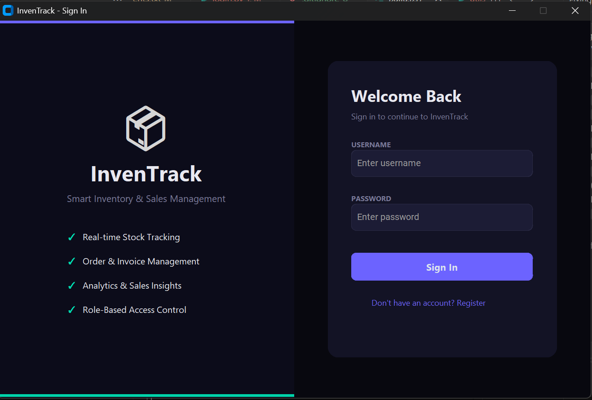
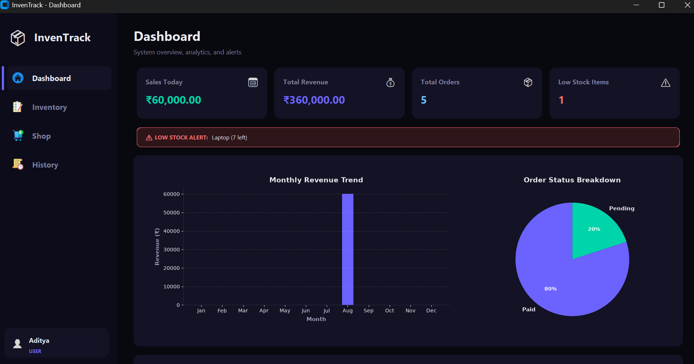
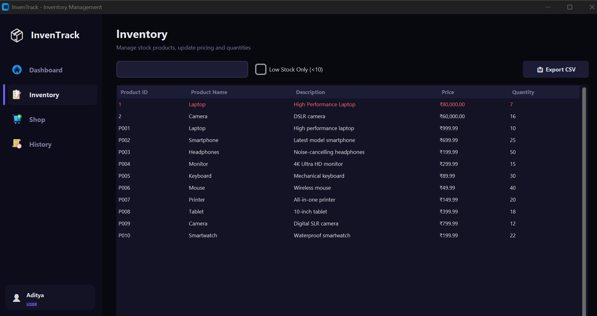
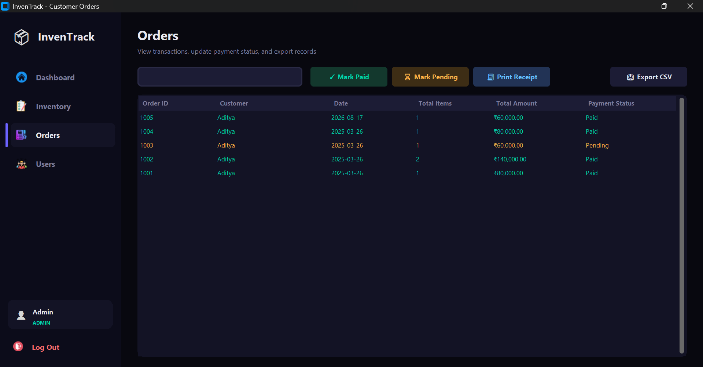
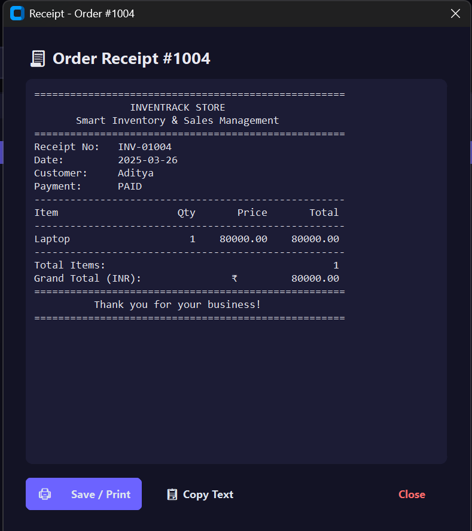
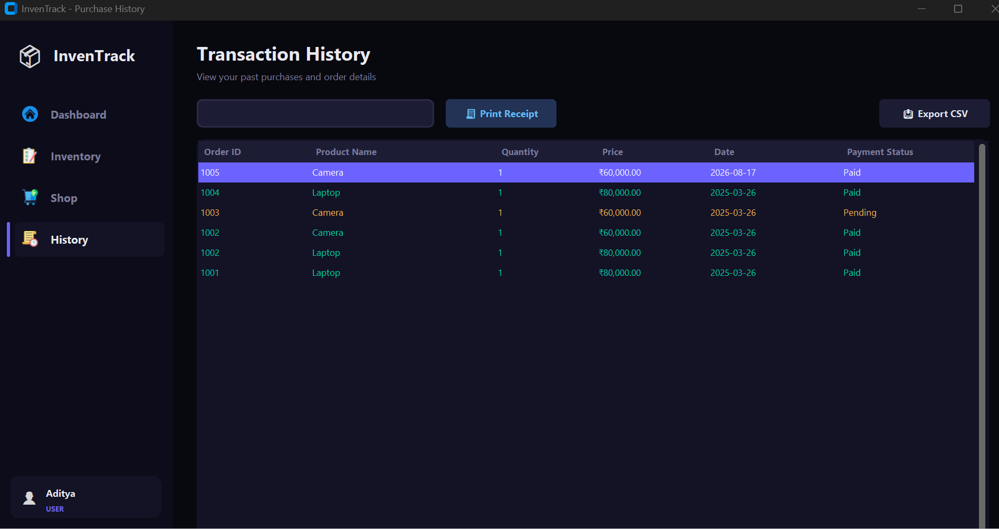
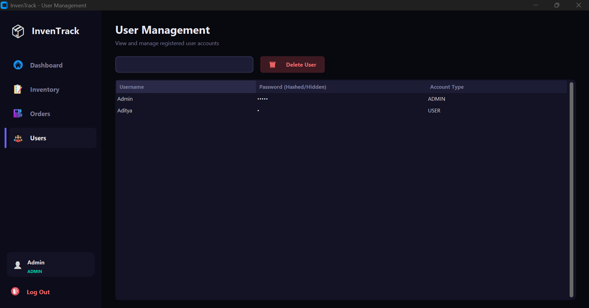

# InvenTrack - Modern Inventory Management System

A desktop inventory, sales, and analytics management application built with Python, **CustomTkinter** (modern dark theme), **Matplotlib** data visualization, and a local **SQLite** database.

---

## ⚡ Quick Download (.exe)

Want to run the application immediately without installing Python or dependencies?

👉 **[Download the Latest Executable (`.exe`) from GitHub Releases](https://github.com/jackhallloween21/Inventory-Management-System-Customtinkter/releases/latest)**

1. Navigate to the [Releases](https://github.com/jackhallloween21/Inventory-Management-System-Customtinkter/releases) section.
2. Download the `InventoryManagementSystem.exe` file under **Assets**.
3. Double-click the `.exe` to launch the application.

---

## ✨ Features

- 🎨 **Modern Dark UI:** Sleek glassmorphism-inspired dark palette powered by `customtkinter`.
- 📊 **Real-time Analytics Dashboard:** Dynamic sales metrics, revenue tracking, low stock alerts, and embedded Matplotlib charts (monthly revenue trend & order status breakdown).
- 📦 **Stock & Inventory Control:** Real-time stock counts, product search & filter, low-stock highlighting, and Add/Edit/Delete products.
- 🛒 **Customer Store & Shopping Cart:** Integrated product catalog, cart item quantity management, duplicate product aggregation, and instant checkout.
- 🧾 **Printable Receipts & Invoices:** Instant formatted invoice generation upon order placement, with options to save to file, copy text, or open in system printer/viewer.
- 📋 **Order & Transaction Management:** Comprehensive order tracking, payment status toggling (`Paid` / `Pending`), and customer purchase history.
- 📥 **CSV Data Export:** Export table records (Inventory, Orders, History) directly to `.csv` files.
- 👥 **Role-Based Access Control:** Separate navigation views and permissions for **Administrator** and standard **User** accounts.

---

## 📸 Screenshots

### 1. Sign In & Authentication


---

### 2. Analytics Dashboard


---

### 3. Inventory Management


---

### 4. Customer Orders (Admin View)


---

### 5. Printable Order Receipts


---

### 6. Transaction History (User View)


---

### 7. User Management (Admin Only)


---

## 🚀 Running from Source

### Prerequisites
- Python 3.10+ (Fully compatible with Python 3.13)

### Installation

1. **Clone the repository:**
   ```bash
   git clone https://github.com/jackhallloween21/Inventory-Management-System-Customtinkter.git
   cd Inventory-Management-System-Customtinkter
   ```

2. **Create and activate a virtual environment:**
   ```powershell
   python -m venv .venv
   .\.venv\Scripts\Activate.ps1
   ```

3. **Install dependencies:**
   ```powershell
   pip install -r requirements.txt
   ```

---

## 💻 Usage

Run the main application:
```powershell
python main.py
```

### Default Credentials
- **Admin Username:** `Admin` (or `admin`)
- **Admin Password:** `Admin`
- *New users can also register their own accounts directly from the Sign In window.*

---

## 🔨 Building Standalone Executable (.exe)

You can compile your own standalone single-file portable Windows executable using PyInstaller:

```powershell
.\build.ps1
```
The compiled executable will be generated in the `dist/` directory.

---

## 🗄️ Database Architecture
Data is persisted in a local `inventory.db` SQLite database with the following relational schema:
- `users`: Username, Password, Account Type (`ADMIN` / `USER`)
- `products`: Product ID, Product Name, Description, Price, Quantity
- `orders`: Order ID, Customer, Date, Total Items, Total Amount, Payment Status
- `order_items`: Order Item ID, Order ID, Product ID, Quantity, Price
